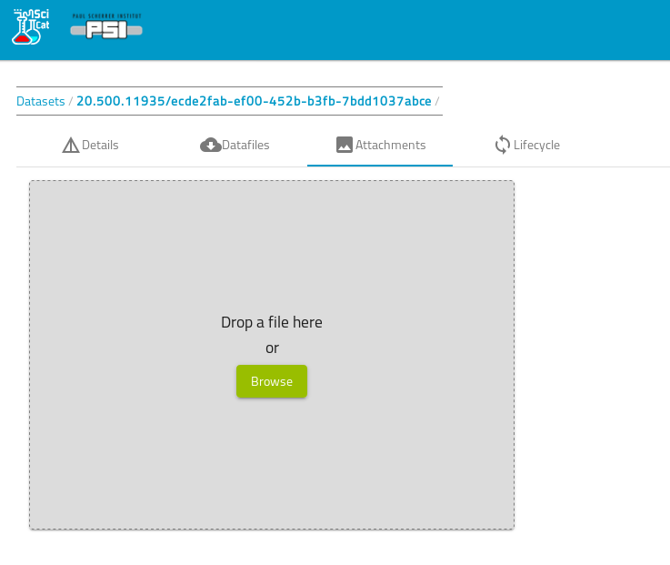
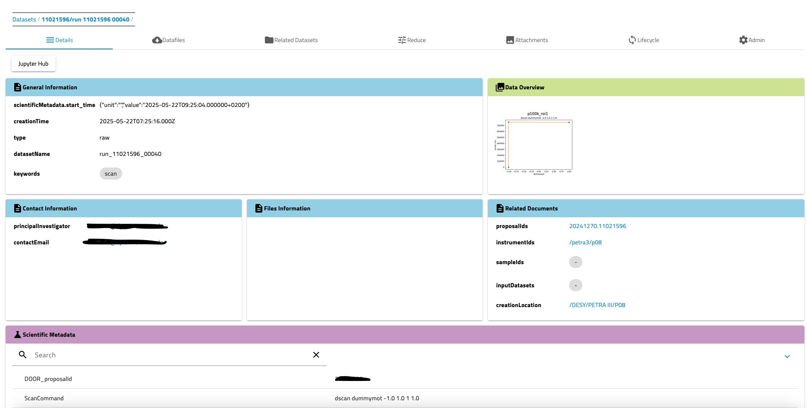

# Datasets
SciCat datasets are sets of metadata and can include several files which e.g. comprise a self-contained measurement - which is fully customizeable during ingestion of metadata. Users can search, view different formats (e.g. in tree, tables or as JSON) of the dataset and list them. 

To group and tag datasets is depicted [here](grouping_tagging_ds.md). Datasets can also be issued to be **published**: either removing the restricted view or triggering the process of obtaining a DOI for the selected datasets. For more details see [publication of SciCat datasets](Publishing.md).

## How to search for datasets

You can use several places to query your datasets: 

* on the top the search bar and
* on the left in the filter & conditions column. The search is configurable to show only what you would like to see and you can define your own conditions making use of your specific scientific metadata.

The bar looks like this:


Filtering and condtions can be applied like that. On the very left one sees this column:


 If you chose "More Filters" a pop-up window appears where you can chose which of the filters you want to display. You can also add your own conditions as well (visible in the background under conditions):


## Dataset file listing
Here is the view of files belonging to a dataset: Below the PID on the top, one finds the tab **Datafiles**:


Do not forget to reset your filters if you will be searching with new criteria! 

## Dataset attachments
What kind of attachement can be saved? Will they be searchable? Can also other formats be attached than pngs?

On the dataset details page, you can click on the Attachments tab


Simply follow the instructions to upload an image. The size is restricted to be below 16 MB.

## View raw JSON data

Scientific meta data is shown in JSON under its section and looks like this:


## Get raw JSON data

One can also get the JSON file via the swagger API. If set up, one can directly access the API endpoints of SciCat backend. Usually the address is in the form: ```my-scicat-instance.country/explorer```, swagger is accessible via the explorer. One needs to authenticate by copying the token from the GUI into the field **authorize**, then find the dataset of interest, by trying it out it will display you dataset and you can download it in JSON format.

## Edit Scientific meta data
If enabled, fields in the scientific metadata can be modified and edited by the owner of the data by hitting the "Edit" Icon. The user can add,remove or change metadata fields, every change will create a new record in the databse with it's history [feature is soon available again from 2025-07-02].


## Properties of a dataset in SciCat

In the section General information one can input names, owner, PID, data type and more. Additional information is displayed on the detailed dataset overview page:  NOTE THERE ARE OBVIOUSLY THINGS TO BE FIXED!!



### New developments on dataset types
Generalize datatypes to remove restrictions of ```raw``` and ```derived``` types.

[datasetTypes](../datasets/datasetTypes.md)